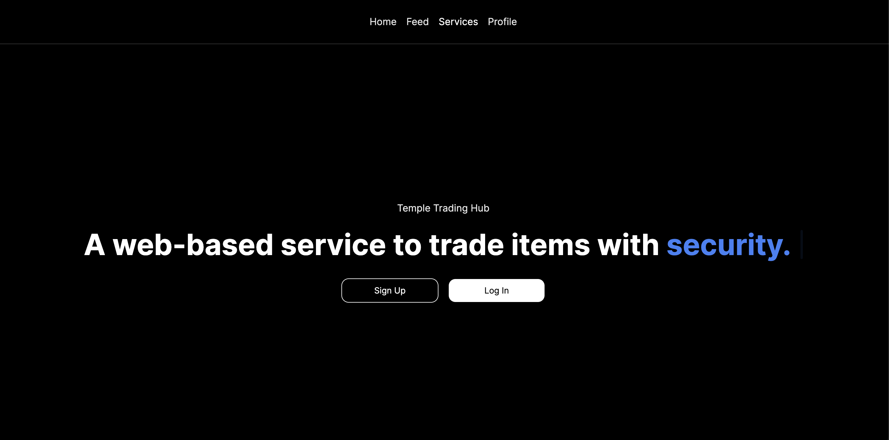

# Temple Trading Hub
Temple Trading Hub (TTH) is a specialized web application tailored specifically for the Temple University community, 
offering a secure and convenient platform for trading various items within the campus environment, 
such as textbooks, electronics, furniture, clothes, and more.

# Homepage


# How to run
1. Clone this repository to your local machine:
```
git clone https://github.com/cis3296s24/tth.git
```

2. navigate to the project directory:
```
cd tth/tth
```
3. Ensure you have Node.js installed. You can download and install it from [here](https://nodejs.org/en/download).

4. Check if you have Node.js and npm installed:
- Open a terminal window and type the following commands:
    ```
    node -v
    npm -v
    ```
- If Node.js and npm are installed, you'll see their version numbers

5. Install dependencies using npm:
```
npm install
```

6. Once the installation is complete, start the application by running:
```
npm run dev
```
7. Access the application in your web browser at http://localhost:3000.


# Contributing to TTH

## Pull Request

1. Fork this repo and create your branch.
2. make sure to test your code before making a pull request.
3. Ensure to describe your pull request. 
